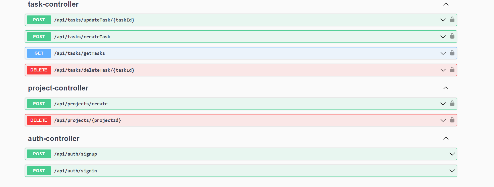

# Task Manager

Это RESTful API приложение для управления задачами и проектами. Ниже приведена информация о стеке технологий, используемых в проекте:

## Технологии

- **Java и Spring Framework**: Весь проект написан на Java с использованием Spring Framework, что обеспечивает мощную поддержку для создания RESTful API и управления зависимостями.

- **Spring Security**: Используется для обеспечения безопасности приложения, включая аутентификацию и авторизацию с использованием JWT.

- **JWT (JSON Web Token)**: JWT используется для безопасной передачи информации между сервером и клиентом.

- **Hibernate/JPA**: Для взаимодействия с базой данных. Позволяет легко работать с объектно-реляционной маппингом.

- **RESTful API**: Весь функционал предоставляется в виде RESTful API, что облегчает взаимодействие с клиентами.

- **Maven**: Используется для управления зависимостями и сборки проекта.

## Описание проекта

Этот проект представляет собой систему управления задачами и проектами. Он обеспечивает возможность создания, обновления и удаления задач, а также управления проектами.

## Установка и запуск

Чтобы развернуть проект локально, выполните следующие шаги:

1. Склонируйте репозиторий на свой локальный компьютер.
2. Убедитесь, что у вас установлены Java, Spring Framework и Maven.
3. Используйте Maven для сборки проекта.
4. Запустите проект на вашем локальном сервере.

## Auth Controller Endpoints

### 1. **Аутентификация пользователя**
   - **Эндпоинт**: `POST /api/auth/signin`
   - **Описание**: Этот эндпоинт позволяет пользователю аутентифицироваться, предоставив свои учетные данные (имя пользователя и пароль). В случае успешной аутентификации, возвращается JWT-токен, содержащий информацию о пользователе и его ролях.
   - **Аутентификация**: Осуществляется аутентификация с использованием предоставленных учетных данных.

### 2. **Регистрация пользователя**
   - **Эндпоинт**: `POST /api/auth/signup`
   - **Описание**: Этот эндпоинт позволяет пользователю зарегистрироваться, предоставив информацию о себе, включая имя пользователя, адрес электронной почты и пароль. При успешной регистрации, пользователю присваивается роль "USER" и сохраняются его учетные данные.
   - **Аутентификация**: Не требуется.

## Task Controller Endpoints

### 1. **Создание задачи**
   - **Эндпоинт**: `POST /api/tasks/createTask`
   - **Описание**: Этот эндпоинт используется для создания новой задачи. Клиент должен предоставить данные о задаче в формате JSON, включая заголовок, описание, приоритет и, при необходимости, идентификатор проекта.
   - **Аутентификация**: Требуется JWT-токен в заголовке запроса.

### 2. **Удаление задачи**
   - **Эндпоинт**: `DELETE /api/tasks/deleteTask/{taskId}`
   - **Описание**: Этот эндпоинт позволяет удалять задачу по её идентификатору. Запрос должен включать идентификатор задачи в URL.
   - **Аутентификация**: Требуется JWT-токен в заголовке запроса.

### 3. **Обновление задачи**
   - **Эндпоинт**: `POST /api/tasks/updateTask/{taskId}`
   - **Описание**: С помощью этого эндпоинта можно обновить задачу, указав её идентификатор и передав новые данные в формате JSON. Обновляются заголовок, описание, приоритет и, при необходимости, идентификатор проекта.
   - **Аутентификация**: Требуется JWT-токен в заголовке запроса.

### 4. **Получение списка задач**
   - **Эндпоинт**: `GET /api/tasks/getTasks`
   - **Описание**: Этот эндпоинт позволяет получить список задач пользователя. Возвращает список задач в формате JSON.
   - **Аутентификация**: Требуется JWT-токен в заголовке запроса.

## Project Controller Endpoints

### 1. **Создание проекта**
   - **Эндпоинт**: `POST /api/projects/create`
   - **Описание**: Этот эндпоинт используется для создания нового проекта. Клиент должен предоставить данные о проекте в формате JSON, включая название.
   - **Аутентификация**: Требуется JWT-токен в заголовке запроса.

### 2. **Удаление проекта**
   - **Эндпоинт**: `DELETE /api/projects/{projectId}`
   - **Описание**: С помощью этого эндпоинта можно удалить проект по его идентификатору. Запрос должен включать идентификатор проекта в URL.
   - **Аутентификация**: Требуется JWT-токен в заголовке запроса.

## Скриншоты

В этом разделе представлены скриншоты вашего приложения или интерфейса. Вы можете добавить скриншоты, чтобы пользователи могли увидеть, как выглядит ваше приложение в действии.

